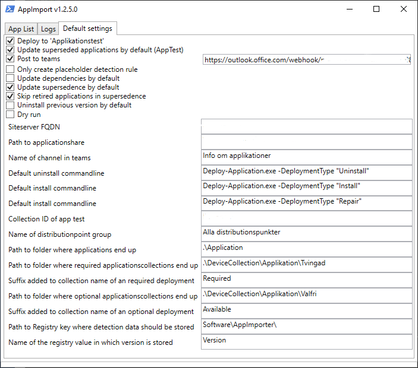

# PLS AppImporter and Deploy

The application is an extension to Config Manager (SCCM) which automates two different tasks. Importing applications (mainly written in [PSADT](http://psappdeploytoolkit.com/)) and deploy applications to different collections.

## PLS AppImport

## How to use

When the application starts it will scan a specified folder and find all applications which are not available in ConfigMgr. The structure of an application should be a folder which is the applications name and subfolders which are different versions. For example:

* \\\\server\\application-sources
    * MyApplication
        * icon.png (or .jpg or .ico)
        * 1.0
        * 1.1

When the scan is done you can select the applications you want to import.

**Here is a little "gotcha"**: selecting an application doesn't show the import settings for that. You have to click on the name to get the settings for the particular application. The cause of this is that it's hard to listen to events from controls which have been created "on-the-fly".

The import of an application uses the following settings

* **Install commandline** -
Which command to run during installation. Usually you don't have to change this if you use PSADT
* **Uninstall commandline** -
Which command to run during uninstallation. Usually you don't have to change this if you use PSADT
* **Repair commandline** -
Which command to run when the user clicks repair in Software Center. Usually you don't have to change this if you use PSADT
* **Post import to Teams channel** - Sends a message to a channel in Microsoft Teams after importing an application. The message is sent using a webhook.
* **Skip creating detectionmethod** -
The import doesn't try to create detection rules from previous version or from MSI-files and just creates a placeholder rule
* **Uninstall previous version (just not replace)** - 
If the import finds an earlier version will it create a superseedence rule. Make sure you select this if you want the installation of this version to first uninstall the previous version.
Many applications can be installed over an older version but if not check this setting.
* **Automatically update chain of supersedence** - If an older version of an application is imported and this is selected then the imported application will be inserted in the chain of supersedence between the versions which are older and newer than this one.
* **Should Deploy to 'Applicationstest'** - 
Should the application be deployed to the test collection (which is specified in Config.json)
** **Automatically update superseded** - 
If an earlier version is installed on a computer in the test collection should it automatically be updated. Otherwise must the user update it within Software Center.

After checking applications and pressing "Import selected applications" the import will start and the application switches to the tab named Logs.

### Logs

This shows information in two fields: "Log" shows what the application does and "Todo" shows things you must check up by hand. For every imported applications will these steps be executed:

1. Find older and newer versions of the application. If a **newer** version is found will you get a warning in "Todo".
1. Creates the application. Import icon if a file icon.jpg (.png or .ico) exists in the applications folder. If icon is bigger than 250x250 will it warn.
1. Create a script installation.
1. Create detection rules (se below)
1. If an older version exists is the dependencies copied frpm that version.
1. If an older version exists is a superseedence rule created.
1. The application is distributed to the distribution group specified in Config.ps1.
1. Deploy the appliction to the test collection if this is specified.

## Detection-rules

* If the folder fils in the application version folder (for example: \\\\server\\application-sources\\MyApplication\\1.1\\files) contains MSI-files will one rule be generated
for each file on Product key and version number. If the appliction contains MSP-files the version could be different and these rules must be updated.
* If DeployApplication.ps1 contains the string Add-SCCMDetection (an extension to PSADT we created) a rule for the registry value this function writes will be generated.
* If the version of the application has the form x.x.x and previous version contains a rule for file with version between x.x.x.0 and x.x.x.99999 will the rule be copied
but replaced with the current version. Practical then version is x.x.x (for example 2.1.4) but the exe file contains a build number (for example 2.1.4.6778).
* If version is in the form x.x.x.x and previous application has a rule on file version in the form x.x.x.x will it be copied but replaced with current version.
* All other rules for registry, files and folders will be copied and if the contain x.x where x is digits will a warning be written in Todo in case it is an version specifik path or value.

## PLS Deploy

If you right-click on an appliction in ConfigMgr the entry AppImporter Deploy should be present close the bottom of the menu. A simple explanation of the entries in the submenu:

* **All available applications** - Deploy as available but allow the end user to install the application manually in Software Center.
* **All available applications (automatic upgrade)** - Deploy as available but with the option to automatically upgrade any superseded version.
* **Single App Collection - Required** - Deploy to a collection as required. If the collection doesn't exist it will be created and if config.json contains a collection name suffix it will be added to the name of this collection.
* **Single App Collection - Available** - Deploy to a collection as required. If the collection doesn't exist it will be created and if config.json contains a collection name suffix it will be added to the name of this collection.
* **AppTesting - Available** - Deploys the application to the specified test collection as available
* **AppTesting - Available (automatic upgrade)** - Deploys the application to the specified test collection as available and with automatic upgrade
* **AppTesting - Required** -  - Deploys the application to the specified test collection as required

## Default settings

The settings in this tab are used as default when adding applications to the tab App List and when using the menu AppImporter Deploy.

A config.json is expected in C:\\Program Files\\PLS\\AppImportAndDeploy and once a user has started AppImporter a config.json is saved to
C:\\Users\\USERNAME\\AppData\\PLS\\AppImporter. The config is saved when something changes in the tab Default settings.

* **Deploy to 'Applikationstest'** - As the name implies, if this is selected then all imported applications will be deployed to the test collection unless it is deselected on a specific application.
* **Update superseded applications by default (AppTest)** - Will update superseded versions of the application when deployed to AppTest
* **Post to teams** - Post to teams by default and use the URI specified on the box to the right.
* **Only create placeholder detection rule** - Do not try to create detection rules, create a rule which needs to be edited when the import is done.
* **Update dependencies by default** - Applications which is dependent of a superseded version will have its dependency updated to the imported version. Note that this is done upon import right now, this should be an entry in the menu AppImporter Deploy.
* **Update supersedence by default** - Default to adding a supersedence rule.
* **Skip retired applications in supersedence** - Exclude retired applications when searching for applications to supersede
* **Uninstall previous version by default** - Most applications can be updated without uninstalling the previous version but select this if an uninstallation should be done by default.
* **Dry run** - Run through the process but to not actuall import anything.
* **Siteserver FQDN** - Hostname of the siteserver which should be used.
* **Path to applicationshare** - A path where the siteserver can list folders and read the contents.
* **Name of channel in Teams** - Used where the name of the channel is displayed in this user interface.
* **Default uninstall commandline** - Commandline to set as uninstall commandline for applications added to the App List
* **Default install commandline** - Commandline to set as install commandline for applications added to the App List
* **Default repair commandline** - Commandline to set as repair commandline for applications added to the App List
* **Collection ID of app test** - Insert the collection id of the collection used for application testing
* **Name of distributionpoint group** - The name of the distributionpoint group which the application should be distributed to
* **Path to folder where applications end up** - Path of the folder in which the imported applications are saved
* **Path to folder where required applicationscollection end up** - Path of the folder in which the required collection are stored
* **Suffix added to collection name of a required deployment** - Text to be appended to the name of the required collection.
* **Path to folder where available applicationscollection end up** - Path of the folder in which the available collection are stored
* **Suffix added to collection name of an available deployment** - Text to be appended to the name of the avilable collection.
* **Path to registry key where detection data should be stored** - Path of the detection data when Add-SCCMDetectionData is found.
* **Name of the registry value in which version is stored** - Name of the value which is used as detection when Add-SCCMDetectionData is found.