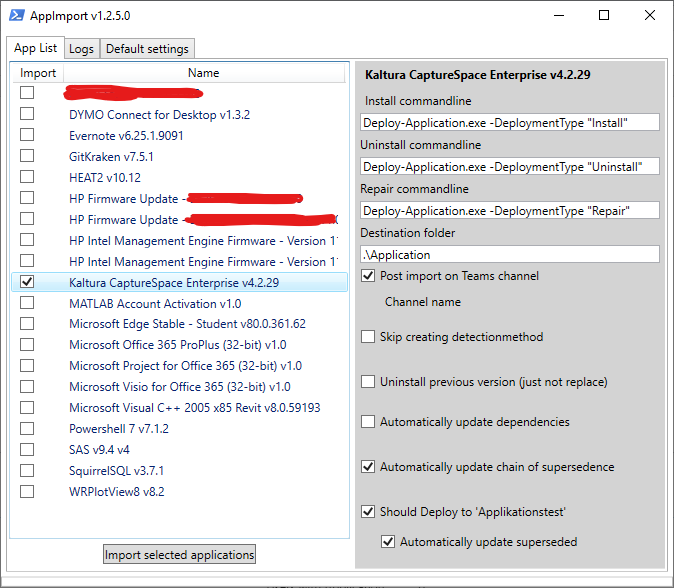
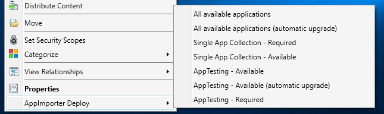

# PLS AppImporter and Deploy

The application is an extension to Config Manager (SCCM) which automates two different tasks. Importing applications (mainly written i [PSADT](http://psappdeploytoolkit.com/)) and deploy applications to different collections.

## PLS AppImport

## How to use

Then the application starts will it search thru a specified folder and find all applications not imported into SCCM. The file structure of an application should be a folder which is the applications name and subfolders which are different versions. For example:

* \\server\appliction-sources
    * MyApplication
        * icon.png (or .jpg or .ico)
        * 1.0
        * 1.1

Then the search is finsished can you select the applications you want to import. Here is a little "cotcha" selecting an application doesn't show the import settings for that. You have to click on the name to get the settings for the particular application.

The import have these settings

* Install commandline -
Which command to run on installation. Usually you don't have to change this if you use PSADT
* Uninstall commandline -
Which command to run on uninstallation. Usually you don't have to change this if you use PSADT
* Skip creating detectionmethod -
The import doesn't try to create detection rules from previous version or from MSI-files and just creates a placeholder rule
* Uninstall previous version (just not replace) - 
If the import finds an earlier version will it create a superseedence rule. If you want the installation of this version to first uninstall the previous version.
Many applications can be installed over an older version but if not check this setting.
* Should Deploy to 'Applicationstest' - 
Should the application be deployed to the test collection (which is specified in Config.ps1)
** Automatically update superseded - 
If an earlier version is installed on a computer in the test collection should it automatically be updated. Otherwise must the user update it within Software Center.

After checking applications and pressing "Import selected applications" will the import start and the application switches to...

### Logs

This shows information in two fields: "Log" shows what the application does and "Todo" shows things you must check up by hand. For every imported applications will these steps be executed:

1. Find older and newer versions of the application. If a **newer** version is found will you get a warning in "Todo".
1. Creates the application. Import icon if a file icon.jpg (.png or .ico) exists in the applications folder. If icon is bigger than 250x250 will it warn.
1. Create a script installation.
1. Create detection rules (se below)
1. If an older version exists is the dependencies copied frpm that version.
1. If an older version exists is a superseedence rule created.
1. The application is distributed to the distribution group specified in Config.ps1.
1. Deploy the appliction to the test collection if this is specified.

#### Detection-rules

* If the folder fils in the application version folder (for example: \\server\application-sources\MyApplication\1.1\files) contains MSI-files will one rule be generated
for each file on Product key and version number. If the appliction contains MSP-files may the version be different and these rules must be updated.
* If DeployApplication.ps1 contains Add-SCCMDetection (an extension to PSADT we created) will a rule for the registry value this function writes be generated.
* If the version of the application has the form x.x.x and previous version contains a rule for file with version between x.x.x.0 and x.x.x.99999 will the rule be copied
but replaced with the current version. Practical then version is x.x.x (for example 2.1.4) but the exe file contains a build number (for example 2.1.4.6778).
* If version is in the form x.x.x.x and previous application has a rule on file version in the form x.x.x.x will it be copied but replaced with current version.
* All other rules for registry, files and folders will be copied and if the contain x.x where x is digits will a warning be written in Todo in case it is an version specifik path or value.

## PLS Deploy

If you right-click on an appliction in SCCM will you see PLS Deploy with four choices at the end of the menu.

* Alla tillgängliga
* Alla tillgängliga (automatisk uppgradering) 
* Tvingande
* Applikationstest

### Alla tillgängliga
All available (collection in Config.ps1) which is for for application which is optional and available in Software Center.

### Alla tillgängliga (automatisk uppgradering)
Same as above but with automatic upgrade of installed versions.

### Tvingande
Application will be installed on all computers which are members of the collection Tvingad/Application name. For example MyApplication v1.4 will be deployed to the collection "Tvingad / MyApplication". If the collection don't exist it is created.

### Applikationstest
Collection for testing applications.
